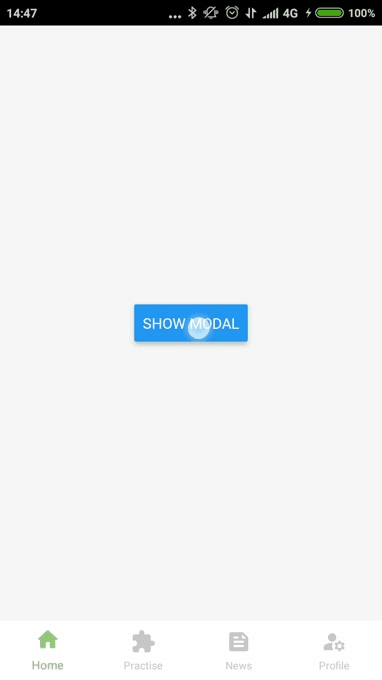

#  :page_with_curl: ​React Native Navigation Bottom Sheet Extension

A performant customizable bottom sheet component made on top of wix react-native-navigation library. The component is built using [react-native-gesture-handler](https://github.com/kmagiera/react-native-gesture-handler) and [react-native-reanimated](https://github.com/kmagiera/react-native-reanimated). This solution uses showModal under the hood to display the bottom sheet, so pressing back button will close the component.

|      |  |      |  |      |
| ---- | :----------------------------: | ---- | :-----------------------------: | ---- |

To replicate the behavior of the bottom sheet as showcased in gifs above check out the `example/` folder.

## ✨ Features

* Smooth interactions & snapping animations
* Customizable
* Supports multiple snapping points
* Responds to back button press without any additional configuration
* Support for scroll view (does not track velocity yet)

Note that scroll view does not track velocity of a pan movement yet, so there's just dragging animation. It will be added in the near future though.

## 📦 Installation

If you are using npm:

```sh
npm install react-native-navigation-bottom-sheet 
```

If you are using yarn:

```sh
yarn add react-native-navigation-bottom-sheet 
```

Then you need to install dependecies:

```sh
npm install react-native-gesture-handler react-native-reanimated@1.13.2
```

```sh
yarn add react-native-gesture-handler react-native-reanimated@1.13.2
```

## 🚀 Usage

You should initialize RNNBottomSheet first by calling init() method.

Then you can open the bottom sheet using the openBottomSheet() method. This function accepts object with props described in the section below.

```js
import React, { Component } from 'react'
import { Text, View, Button } from 'react-native';
import { RNNBottomSheet } from 'react-native-navigation-bottom-sheet';

RNNBottomSheet.init();

export default class App extends Component {
renderContent = () => (
    <View
      style={{
        backgroundColor: 'white',
        height: 350,
        flexDirection: 'row',
        alignItems: 'center',
        justifyContent: 'center',
        borderRadius: 16,
      }}
    >
      <Text>
        In order to close the modal, you can swipe it down, touch the area outside
        it or press the back button.
      </Text>
    </View>
  );


  render() {
    return (
        <View style={{
            flex: 1,
    		alignItems: 'center',
    		justifyContent: 'center',
    		backgroundColor: 'whitesmoke',
        }}>
          <Button
            onPress={() =>
              RNNBottomSheet.openBottomSheet({
                renderContent: this.renderContent,
                snapPoints: [0, '20%', '40%', '70%'],
                borderRadius: 16,
                onChange: (index: number) => console.log("Snapped to " + index),
              })
            }
            title="Show modal"
          />
        </View>
    );
  }
}
```

## ⚙️ Props

|               name               | required |          type           | description                                                  |
| :------------------------------: | :------: | :---------------------: | ------------------------------------------------------------ |
|            snapPoints            |   yes    |  (number \| string)[]   | Points for snapping of bottom sheet coomponent. They define distance from bottom of the screen. Example: [0, 100, 500]. |
|         initialSnapIndex         |    no    |         number          | Index of a point bottom sheet should snap to when the component mounts. Defaults to the last point specified in the snapPoints array. |
|          renderContent           |    no    |        ReactNode        | Method for rendering scrollable content of bottom sheet.     |
|           renderHeader           |    no    |        ReactNode        | Method for rendering non-scrollable header of bottom sheet.  |
|     dismissWhenTouchOutside      |    no    |         boolean         | Should bottom sheet be dismissed when touched outside. Defaults to true. |
| enabledContentGestureInteraction |    no    |         boolean         | Defines if bottom sheet content could be scrollable by gesture. Defaults to true. |
|           fadeOpacity            |    no    |         number          | Opacity of the screen outside the bottom sheet. Defaults to 0.7. |
|           borderRadius           |    no    |         number          | Border radius of the bottom sheet. Note if you have header rendered, header should have border radius too. |
|         backgroundColor          |    no    |         string          | Background color of the bottom sheet. Defaults to '#fff'.    |
|             onChange             |    no    | (index: number) => void | Callback when the sheet position changed.                    |
|              style               |    no    |        StyleProp        | Any valid style properties.                                  |

## :wrench: Methods

`init()`

A wrapper around _Navigation.registerComponent()_ function. Name assigned to the component can be received later by calling _getComponentName()_ method.

`openBottomSheet(props)`

Opens the bottom sheet and snaps it to the point either specified in props or to the top one otherwise. A wrapper function around _Navigation.showModal()_, that passes the props along with other options.

`closeBottomSheet()`

Closes the bottom sheet.

`getComponentName()`

Returns a name of the component that is used when calling registerComponent() method.

`isOpened()`

Returns a boolean indicating whether the bottom sheet is opened or not.

## :clipboard: Todo

The project is still in development and here's a list of features / fixes i am planning to address:

- [ ] add decay animation for scrolling
- [ ] add support for FlatList and SectionList (wrapper around these functions)
- [ ] add more options for customization
- [ ] add an option to dynamically change opacity of the bottom sheet
- [ ] add dedicated support for horizontal scrolling inside the bottom sheet
- [ ] explore new ways to optimize animations and loading of the bottom sheet

Feel free to suggest your own ideas.

## :bug: ​Something doesn't work?

Don't hesitate to file an issue about any kind of malfunction you experienced. You can also DM me by my email imaginary.loyalist@gmail.com

## :book: License

MIT

